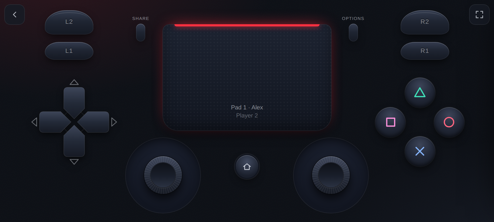
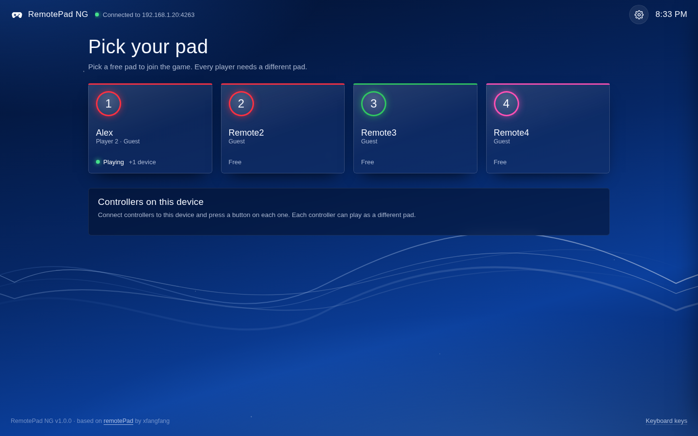
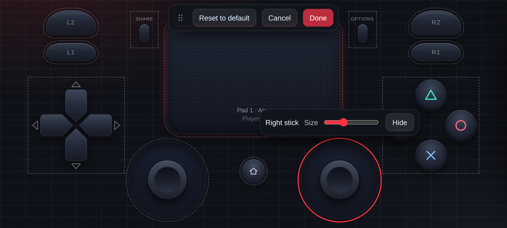
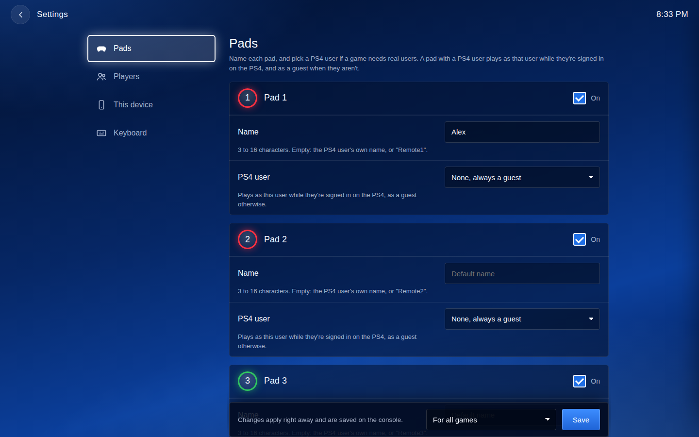

# RemotePad NG

> [!TIP]
> **Try [Control4Free](https://github.com/MoHadiShibli/Control4Free), the improved approach.** Instead of working
> around the PS4 with a plugin inside each game, it uses the PS4's own virtual controller service. Your
> controllers work in the PS4's menus and on the home screen too, and each one is assigned to a user natively,
> through the PS4's own *"Who's using this controller?"* screen.
>
> RemotePad NG and Control4Free aren't compatible: choose one. To switch, remove RemotePad NG's line from
> `plugins.ini` and follow
> [Control4Free's quick start](https://github.com/MoHadiShibli/Control4Free#quick-start).

**Play your jailbroken PS4 with the controllers you already have.** Xbox, DualSense, Switch Pro and most
other controllers work, and your phone, tablet or keyboard can be a controller too.

RemotePad NG is a GoldHEN plugin that adds up to four extra DualShock 4 controllers to your games. Connect
your controllers to a phone or computer, open the plugin's page in its browser and give each one a pad: the
game sees it as a DualShock 4. You don't need to buy more DualShocks for local multiplayer, and there's
nothing to install on the phone or computer.

## About this fork

RemotePad NG is a maintained fork of [remotePad](https://github.com/xfangfang/remotePad) by
[xfangfang](https://github.com/xfangfang), who wrote the original plugin. The original hasn't had a release or
an update in over a year: its last release is 1.2.0, from March 2025.

I took the project on because I use it and kept running into issues. Setting it up and playing with it was
also unfriendly. My focus has been to make RemotePad an easy solution for anybody. This first release fixes
many issues in the plugin and polishes the whole experience, from installing it to picking a pad on your
phone.

## Features

- **The controllers you already have.** Xbox, DualSense, DualShock, Switch Pro and most others work through
  your phone or computer. Each one can play as its own pad, so one computer can run all four.
- **Nothing to install on your phone or computer.** The plugin serves its own page; open it in any browser on
  your network.
- **Pick a pad, play.** The home screen shows the four pads live: free, joining the game, or playing. A player
  only joins the game when someone picks their pad.
- **An on-screen DualShock 4**: multi-touch, analog sticks, a two-finger touchpad, vibration, and the pad's
  light bar color.
- **Your own button layout.** Drag, resize or hide any button, with "Reset to default". Each device keeps its
  own layout.
- **A keyboard** with keys you can change.
- **Settings on the page**: pad names, PS4 users, which pads are on, how players join. They're saved on the
  console, for all games or just one.
- **Real PS4 users** for games that need them (saves, online). A pad plays as a guest while its user isn't
  signed in.
- **"Use with the DualShock"**: add your phone to a player's own controller, for example in single-player
  games.
- **Stays awake**: your phone's screen doesn't turn off while you play.
- **Safer on your network**: other websites can't control your pads or change your settings, and the settings
  can be locked.

## Quick start

1. Copy `remote_pad.prx` from the [latest release](https://github.com/MoHadiShibli/remotePad-ng/releases/latest)
   to `/data/GoldHEN/plugins/` on your PS4.
2. Add this line under `[default]` in `/data/GoldHEN/plugins.ini`:
   `/data/GoldHEN/plugins/remote_pad.prx`
3. Turn on **Enable Plugins Loader** in GoldHEN's settings, then start a game.
4. On your phone, open the address from the notification (for example `http://192.168.1.20:4263`) and pick a
   pad.

New to GoldHEN plugins? The **[installation guide](https://github.com/MoHadiShibli/remotePad-ng/wiki/Installation)**
walks through every step. It works wherever GoldHEN's plugin loader works, and was tested on firmware 10.01 with
GoldHEN v2.4b18.10.

Coming from the original remotePad? Replace `remote_pad.prx` and you're done. Your `plugins.ini` and
`remote_pad.ini` keep working.

## What's fixed

### Open issues from the original project

| Issue | What was done |
|---|---|
| xfangfang/remotePad#7: "insane delay" | **Fixed.** Every update from the phone was queued, so a game reading one update per frame fell up to two seconds behind. Stick moves now replace the waiting update, and presses are never dropped. The guide also answers that issue's questions about single-player games and Xbox controllers. |
| xfangfang/remotePad#9: games crash after the notification | **Fixed the known causes.** A format-string bug in notifications, a heap overflow in the settings parser, a server thread stack that was too small, missing checks on buffers from games, and crashes when the plugin unloads. Games also see no change until someone picks a pad. |
| xfangfang/remotePad#10: the server doesn't pop up | **Addressed with a clear guide.** The cause was `plugins.ini` in the wrong folder. The [installation guide](https://github.com/MoHadiShibli/remotePad-ng/wiki/Installation) and [troubleshooting](https://github.com/MoHadiShibli/remotePad-ng/wiki/Troubleshooting) pages cover the usual mistakes. |
| xfangfang/remotePad#1: DualSense support | **Partly.** Connect a DualSense, or any other controller, to your phone or computer and give it a pad. Plugging it straight into the PS4 still isn't supported. |

### Other issues fixed

- **Only one pad worked with several PS4 users**: user IDs in hex were read as decimal, so pads got the wrong
  users (xfangfang/remotePad#2). Hex IDs, as Apollo shows them, now work, and decimal ones still do.
- **Remapping keys** needed editing the page's code (xfangfang/remotePad#3). Keys can now be changed in
  Settings → Keyboard.
- **No notification, no `remote_pad.ini`** (xfangfang/remotePad#5) and **`Plugins.ini` with a capital P**
  (xfangfang/remotePad#8): the guide covers both. The settings file is now written from the page.
- **Touchpad for controllers without one** (xfangfang/remotePad#6): Share, Back or Home on a connected
  controller clicks the touchpad.
- **Remote players couldn't join some Unity games**, like Tricky Towers: the player select said "Sign in". These
  games open a second controller port for each player, and the plugin refused it (fixed in 1.0.1).
- Pads were set up as soon as the game started, and every pad looked connected, even with nobody playing.
- Pads took over PS4 users who weren't signed in, and replaced their names and colors.
- `scePadRead` returned corrupted data when more than one update was waiting.
- Held buttons looked released between updates.
- Buttons stayed pressed when a phone went to sleep or lost its connection.
- Clients that send lowercase HTTP headers couldn't connect.
- Vibration and light bar changes were delayed, and vibration went to every device instead of the pad's own.
- Problems in `remote_pad.ini`:
  - a game's own section placed before `[default]` was ignored;
  - a byte order mark from some Windows editors broke the file;
  - `]` inside a value broke it.
- A settings problem turned the whole plugin off.
- Guests are now named after their pad: Pad 1 is "Remote1", it used to be "Remote0".

The full list is in [CHANGELOG.md](CHANGELOG.md).

## Screenshots

| Home screen | Layout editor | Settings |
|---|---|---|
|  |  |  |

## Documentation

The **[wiki](https://github.com/MoHadiShibli/remotePad-ng/wiki)** has the full guide:
- [Installation](https://github.com/MoHadiShibli/remotePad-ng/wiki/Installation)
- [Playing](https://github.com/MoHadiShibli/remotePad-ng/wiki/Playing)
- [Players and PS4 users](https://github.com/MoHadiShibli/remotePad-ng/wiki/Players-and-PS4-Users)
- [Settings reference](https://github.com/MoHadiShibli/remotePad-ng/wiki/Settings-Reference)
- [Troubleshooting](https://github.com/MoHadiShibli/remotePad-ng/wiki/Troubleshooting)
- [FAQ](https://github.com/MoHadiShibli/remotePad-ng/wiki/FAQ)
- [Compatibility](https://github.com/MoHadiShibli/remotePad-ng/wiki/Compatibility)

Developers: [docs/protocol.md](docs/protocol.md) describes the WebSocket protocol, and
[CONTRIBUTING.md](CONTRIBUTING.md) explains how to build and contribute.

## Support

Found a bug? [Open an issue](https://github.com/MoHadiShibli/remotePad-ng/issues/new/choose); I maintain this
project and read every report. If RemotePad NG is useful to you, you can help keep it going on
[Ko-fi](https://ko-fi.com/mohadishibli).

## Credits

- [xfangfang](https://github.com/xfangfang) created remotePad. RemotePad NG is built on their work.
  [jocover](https://github.com/jocover) helped with the original's development.
- [GoldHEN](https://github.com/GoldHEN/GoldHEN) and its plugin SDK, the
  [OpenOrbis toolchain](https://github.com/OpenOrbis/OpenOrbis-PS4-Toolchain), and
  [Mongoose](https://github.com/cesanta/mongoose) for the web server.
- The buttons are drawn after the
  [DualShock 4 layout diagram](https://commons.wikimedia.org/wiki/File:Dualshock_4_Layout.svg) by Tokyoship
  (CC BY 3.0).

### Built with AI help

This release wouldn't have happened without the help of **Claude Opus 5.5**, an AI model by Anthropic, which
worked on the code, tests and documentation with me. AI-written code can look right and still be wrong.
Reviews are very welcome: if you spot AI slop (dead code, wrong assumptions, needless complexity), please
[open an issue](https://github.com/MoHadiShibli/remotePad-ng/issues) or send a pull request.

## License

RemotePad NG is free software under the [GNU General Public License v3](LICENSE).
- Original work: copyright © xfangfang and the remotePad contributors.
- Changes in RemotePad NG: copyright © 2026 MoHadiShibli. They're listed in [CHANGELOG.md](CHANGELOG.md).
